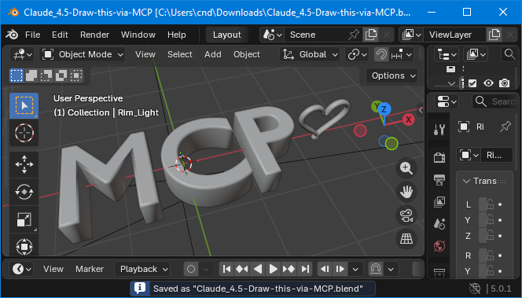

# MCP-Link for Blender

**Transform Blender into an AI-Controllable 3D Creation Platform**

MCP-Link for Blender exposes Blender's entire Python API to AI agents through the Model Context Protocol (MCP). No hardcoded commands - just pure, generic API access that lets AI do anything Blender can do.



## What Makes This Revolutionary

Unlike traditional add-ons, MCP-Link provides **infrastructure**. It's a bridge that lets any AI agent - ChatGPT, Claude, Cursor, or custom agents - control Blender through natural language.

### Three Levels of Power

1. **Python Execution** - Run arbitrary Python code in Blender's runtime with full `bpy` access
2. **Direct API Calls** - Execute any Blender operator or access any data
3. **MCP Tool Integration** - Access 10+ tools (SQLite, browser, AI models, and more)

## Features

- ✅ **100% Generic API** - Works with ANY Blender command
- ✅ **Full Python Access** - Run arbitrary Python code with complete `bpy` access
- ✅ **Persistent Sessions** - Variables persist across multiple AI commands
- ✅ **MCP Tool Ecosystem** - SQLite, browser automation, system control, and more
- ✅ **Auto-Connect** - Extension connects to MCP-Link server on startup
- ✅ **Auto-Reconnect** - Handles connection drops gracefully
- ✅ **Thread-Safe** - Proper main-thread execution for Blender API calls

## Requirements

- **Blender 4.2+** - [Download from blender.org](https://www.blender.org/download/)
- **MCP-Link Server** - [Free download from AuraFriday](https://aurafriday.com/downloads/)
- **MCP-Compatible AI** - [Cursor](https://cursor.com/), Claude Code, or any MCP client

## Installation

### Method 1: From Blender Extensions

1. Open Blender
2. Go to **Edit → Preferences → Get Extensions**
3. Search for "MCP-Link"
4. Click **Install**

### Method 2: From ZIP File

1. Download `mcp_link_blender-x.x.x.zip` from [releases](https://github.com/AuraFriday/MCP-Link-Blender/releases)
2. Open Blender
3. Go to **Edit → Preferences → Add-ons**
4. Click **Install from Disk...**
5. Select the ZIP file

### Method 3: Command Line

```bash
blender --command extension install-file -r user_default -e mcp_link_blender-1.0.0.zip
```

## Usage Examples

### Create a 3D Cube

```json
{
  "operation": "execute_python",
  "code": "import bpy\nbpy.ops.mesh.primitive_cube_add(size=2, location=(0, 0, 1))\nprint(f'Created: {bpy.context.active_object.name}')"
}
```

### Create a Complete Scene

```json
{
  "operation": "execute_python",
  "code": "import bpy\n\n# Clear scene\nbpy.ops.object.select_all(action='SELECT')\nbpy.ops.object.delete()\n\n# Add ground plane\nbpy.ops.mesh.primitive_plane_add(size=10)\n\n# Add a sphere\nbpy.ops.mesh.primitive_uv_sphere_add(radius=1, location=(0, 0, 1))\nsphere = bpy.context.active_object\n\n# Add material\nmat = bpy.data.materials.new('Red')\nmat.diffuse_color = (1, 0, 0, 1)\nsphere.data.materials.append(mat)\n\nprint('Scene created!')"
}
```

### Render to File

```json
{
  "operation": "execute_python",
  "code": "import bpy\nbpy.context.scene.render.filepath = '/tmp/render.png'\nbpy.ops.render.render(write_still=True)\nprint('Rendered!')"
}
```

## Building from Source

```bash
# Clone the repository
git clone https://github.com/AuraFriday/MCP-Link-Blender.git
cd MCP-Link-Blender

# Build the extension
make build

# Install to Blender
make install
```

### Makefile Commands

| Command | Description |
|---------|-------------|
| `make` | Build the extension ZIP |
| `make install` | Build and install to Blender |
| `make clean` | Remove build artifacts |
| `make version` | Show current version |
| `make bump-patch` | Bump patch version (1.0.0 → 1.0.1) |
| `make bump-minor` | Bump minor version (1.0.0 → 1.1.0) |
| `make bump-major` | Bump major version (1.0.0 → 2.0.0) |

## How It Works

1. **Extension loads** when Blender starts
2. **Auto-connects** to the local MCP-Link server via SSE
3. **Registers "blender"** as a remote tool
4. **Listens for commands** from AI agents
5. **Executes on main thread** via `bpy.app.timers` for thread safety
6. **Returns results** to the AI agent

## Privacy & Security

- ✅ **100% Local** - All processing happens on your machine
- ✅ **No Cloud Dependencies** - Works completely offline
- ✅ **No Data Collection** - Your designs never leave your computer
- ✅ **Open Source** - Full transparency, auditable code
- ✅ **GPL-3.0 License** - Free as in freedom

## Troubleshooting

### Extension not connecting

1. Make sure MCP-Link server is running
2. Check Blender's System Console for error messages
3. Verify the server is listening on the expected port

### Commands not executing

1. Ensure Blender is in Object Mode for most operations
2. Check that required objects exist before manipulating them
3. Review the error message in the response

## Contributing

Contributions are welcome! Please see [CONTRIBUTING.md](CONTRIBUTING.md) for guidelines.

## License

GPL-3.0-or-later - See [LICENSE](LICENSE) for details.

## Credits

Created by [Aura Friday](https://aurafriday.com) - Trusted by 15,000+ users of previous add-ins.

---

**Links:**
- [Documentation](https://aurafriday.com/mcp-link)
- [MCP-Link Server Download](https://aurafriday.com/downloads/)
- [GitHub Repository](https://github.com/AuraFriday/MCP-Link-Blender)
- [Issue Tracker](https://github.com/AuraFriday/MCP-Link-Blender/issues)
